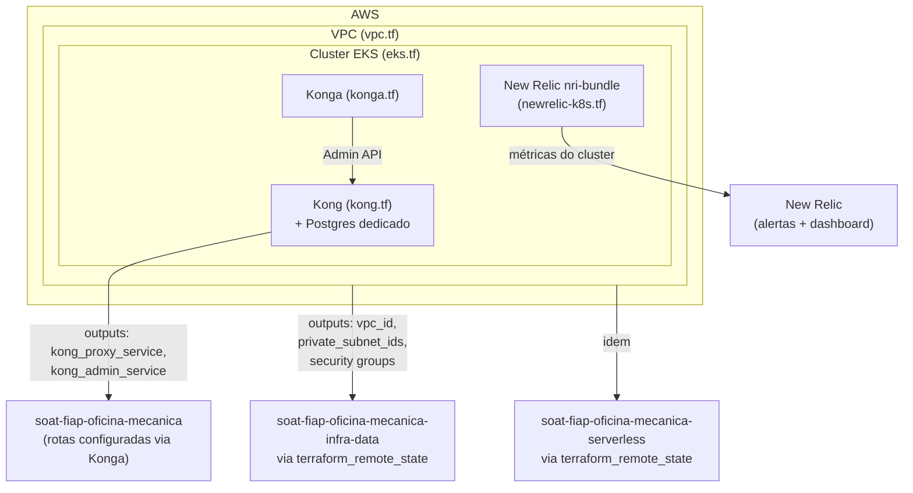

# soat-fiap-oficina-mecanica-infra-kube

Infraestrutura como código (Terraform) para o cluster Kubernetes da oficina mecânica.

## Arquitetura deste repositório



## O que este repositório provisiona

1. **Rede** (`vpc.tf`) — VPC, subnets públicas/privadas, Internet Gateway, NAT Gateway.
2. **Cluster EKS** (`eks.tf`) — control plane gerenciado, node group, IAM roles e security
   groups. Os outputs `vpc_id`, `private_subnet_ids`, `node_security_group_id` e
   `cluster_security_group_id` são consumidos pelo repositório
   [`soat-fiap-oficina-mecanica-infra-data`](https://github.com/arodri19/soat-fiap-oficina-mecanica-infra-data)
   via `terraform_remote_state`, para liberar acesso do RDS aos worker nodes sem duplicar a rede.
3. **API Gateway** (`kong.tf` + `konga.tf`) — [Kong](https://konghq.com/products/kong-gateway)
   instalado via chart Helm oficial (`kong/kong`) com **Postgres dedicado** como datastore
   (provisionado como dependência do próprio chart — não é o RDS da aplicação), e
   [Konga](https://github.com/pantsel/konga) como UI de administração, provisionado
   diretamente via recursos Kubernetes (o chart Helm do Konga está sem manutenção).
   - A Admin API do Kong (porta `8001`) é `ClusterIP`-only — nunca exposta fora do cluster.
   - O Proxy do Kong (porta de entrada do tráfego roteado às APIs) é exposto conforme
     `kong_proxy_service_type` (`ClusterIP`, `NodePort` ou `LoadBalancer`; padrão `LoadBalancer`).

## Observabilidade (New Relic)

- **Monitoramento do cluster** (`newrelic-k8s.tf`) — chart oficial `newrelic/nri-bundle`
  (infraestrutura + kube-state-metrics + Prometheus), cobrindo CPU/memória do cluster.
- **Alertas** (`newrelic-alerts.tf`) — policy + condição NRQL disparando quando erros nas
  rotas `/orders` da aplicação ultrapassam o limite, notificando por e-mail via workflow.
- **Dashboard** (`newrelic-dashboard.tf`) — volume diário de OS, tempo médio de execução por
  status, erros/falhas nas integrações e latência das APIs. As métricas de negócio (volume e
  tempo por status) vêm de eventos customizados (`OrderCreated`/`OrderStatusChanged`) emitidos
  pelo agente APM da aplicação — ver
  [`src/infrastructure/monitoring/newrelicEvents.js`](https://github.com/arodri19/soat-fiap-oficina-mecanica/blob/main/src/infrastructure/monitoring/newrelicEvents.js)
  no repositório `soat-fiap-oficina-mecanica`.
- **Healthcheck/uptime** são cobertos pelas `readinessProbe`/`livenessProbe` do Kubernetes
  (`GET /health`, no próprio repositório da aplicação) — não há um monitor Synthetics público
  aqui porque o `/health` só é exposto dentro do cluster (via Kong, se uma rota for configurada).

## Uso

```bash
cp terraform.tfvars.example terraform.tfvars
# edite terraform.tfvars conforme o ambiente (dev/staging/prod)

terraform init \
  -backend-config="bucket=<TF_STATE_BUCKET>" \
  -backend-config="key=oficina-mecanica/infra-kube/terraform.tfstate" \
  -backend-config="region=us-east-1" \
  -backend-config="dynamodb_table=<TF_STATE_LOCK_TABLE>" \
  -backend-config="encrypt=true"

terraform plan
terraform apply
```

> Como os providers `kubernetes`/`helm` dependem dos outputs de `module.eks`, o `apply`
> inicial (cluster ainda não existe) pode falhar ao configurar esses providers. Nesse caso,
> faça o bootstrap em duas etapas:
> ```bash
> terraform apply -target=module.vpc -target=module.eks
> terraform apply
> ```

### Ordem de implantação entre repositórios

`kong-routes.tf` configura a rota pública de login e a rota protegida por JWT apontando para
a Lambda do repositório `serverless` (lida via `terraform_remote_state`) — mas esse output só
existe depois que o serverless é implantado, que por sua vez depende da VPC deste repositório.
Para não travar o bootstrap, essas rotas são opcionais (`var.enable_kong_jwt_routes`, padrão
`false`). Ordem completa:

```bash
# 1. infra-kube (este repo) — enable_kong_jwt_routes=false (padrão), cria VPC/EKS/Kong/Konga
terraform apply

# 2. infra-data — RDS
# 3. serverless — Lambda (usa outputs do infra-kube e do infra-data)

# 4. infra-kube de novo, agora ligando as rotas JWT
terraform apply -var="enable_kong_jwt_routes=true"
```

No workflow do GitHub Actions (`.github/workflows/terraform.yml`), isso é o input booleano
`enable_kong_jwt_routes` do `workflow_dispatch`.

### Acessando o cluster

```bash
aws eks update-kubeconfig --region us-east-1 --name oficina-mecanica-dev
```
(ou use o output `kubeconfig_command`, que já vem com os valores corretos)

### Acessando o Konga

```bash
kubectl -n kong port-forward svc/konga 1337:1337
```

Abra `http://localhost:1337`, crie o usuário admin no primeiro acesso e conecte-o ao Kong
usando a Admin API interna: `https://kong-admin.kong.svc.cluster.local:8444`.

### Roteando tráfego para os serviços da oficina

A rota pública de login (`/auth/cpf`) e a rota protegida por JWT (`/me`), ambas apontando para
a Lambda de autenticação do repositório `serverless`, são provisionadas por este módulo
(`kong-routes.tf`, opt-in via `var.enable_kong_jwt_routes` — ver "Ordem de implantação" acima).

Rotas para a aplicação principal (`soat-fiap-oficina-mecanica`, neste mesmo cluster) não fazem
parte deste módulo Terraform — configure-as via Konga (UI) ou diretamente pela Admin API do Kong.
