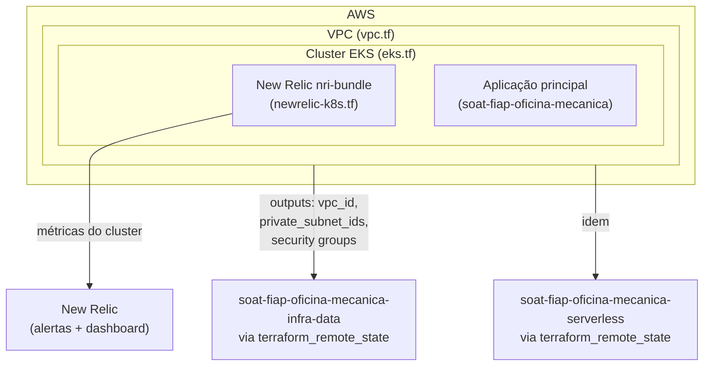

# soat-fiap-oficina-mecanica-infra-kube

Infraestrutura como código (Terraform) para o cluster Kubernetes da oficina mecânica.

## Arquitetura deste repositório



O ponto de entrada público da API (API Gateway) **não** fica neste repositório — vive no
repositório [`serverless`](https://github.com/arodri19/soat-fiap-oficina-mecanica-serverless)
(ver ADR sobre a troca de Kong por AWS API Gateway). Este repositório provisiona só a rede e
o cluster onde a aplicação principal roda, mais o monitoramento de infraestrutura.

## O que este repositório provisiona

1. **Rede** (`vpc.tf`) — VPC, subnets públicas/privadas, Internet Gateway, NAT Gateway.
2. **Cluster EKS** (`eks.tf`) — control plane gerenciado, node group, IAM roles e security
   groups. Os outputs `vpc_id`, `private_subnet_ids`, `node_security_group_id` e
   `cluster_security_group_id` são consumidos pelos repositórios
   [`infra-data`](https://github.com/arodri19/soat-fiap-oficina-mecanica-infra-data) e
   [`serverless`](https://github.com/arodri19/soat-fiap-oficina-mecanica-serverless)
   via `terraform_remote_state`, para liberar acesso ao RDS/Lambda sem duplicar a rede.

## Observabilidade (New Relic)

- **Monitoramento do cluster** (`newrelic-k8s.tf`) — chart oficial `newrelic/nri-bundle`
  (infraestrutura + kube-state-metrics + Prometheus), cobrindo CPU/memória do cluster.
- **Alertas** (`newrelic-alerts.tf`) — policy + condição NRQL disparando quando erros nas
  rotas `/orders` da aplicação ultrapassam o limite, notificando por e-mail via workflow.
- **Dashboard** (`newrelic-dashboard.tf`) — volume diário de OS, tempo médio de execução por
  status, erros/falhas nas integrações e latência das APIs. As métricas de negócio (volume e
  tempo por status) vêm de eventos customizados (`OrderCreated`/`OrderStatusChanged`) emitidos
  pelo agente APM da aplicação — ver
  [`src/infrastructure/monitoring/newrelicEvents.js`](https://github.com/arodri19/soat-fiap-oficina-mecanica/blob/main/src/infrastructure/monitoring/newrelicEvents.js)
  no repositório `soat-fiap-oficina-mecanica`.
- **Healthcheck/uptime** são cobertos pelas `readinessProbe`/`livenessProbe` do Kubernetes
  (`GET /health`, no próprio repositório da aplicação).

## Uso

```bash
cp terraform.tfvars.example terraform.tfvars
# edite terraform.tfvars conforme o ambiente (dev/staging/prod)

terraform init \
  -backend-config="bucket=<TF_STATE_BUCKET>" \
  -backend-config="key=oficina-mecanica/infra-kube/terraform.tfstate" \
  -backend-config="region=us-east-1" \
  -backend-config="dynamodb_table=<TF_STATE_LOCK_TABLE>" \
  -backend-config="encrypt=true"

terraform plan
terraform apply
```

> Como os providers `kubernetes`/`helm` (usados pelo monitoramento de cluster do New Relic,
> `newrelic-k8s.tf`) dependem dos outputs de `module.eks`, o `apply` inicial (cluster ainda
> não existe) pode falhar ao configurar esses providers. Nesse caso, faça o bootstrap em
> duas etapas:
> ```bash
> terraform apply -target=module.vpc -target=module.eks
> terraform apply
> ```

### Acessando o cluster

```bash
aws eks update-kubeconfig --region us-east-1 --name oficina-mecanica-dev
```
(ou use o output `kubeconfig_command`, que já vem com os valores corretos)

## Ordem de implantação entre repositórios

1. **infra-kube** (este repo) — VPC/EKS/monitoramento
2. **infra-data** — RDS
3. **serverless** — Lambda de autenticação + API Gateway (usa outputs do infra-kube e do infra-data)
4. **soat-fiap-oficina-mecanica** (app principal) — deploy no cluster criado no passo 1
